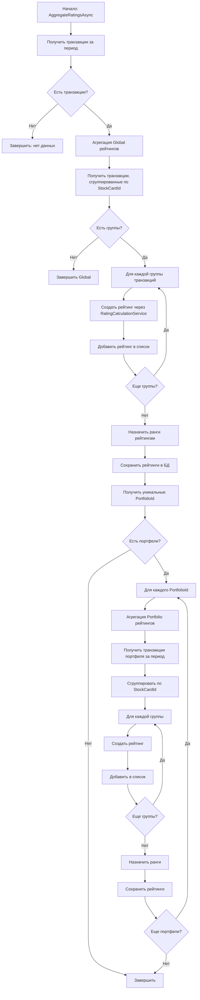
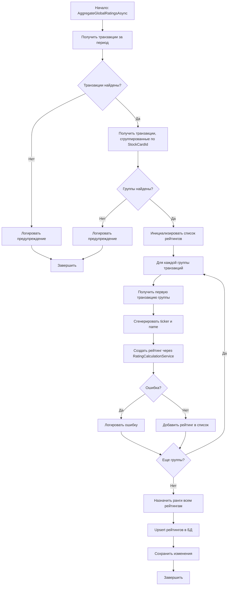
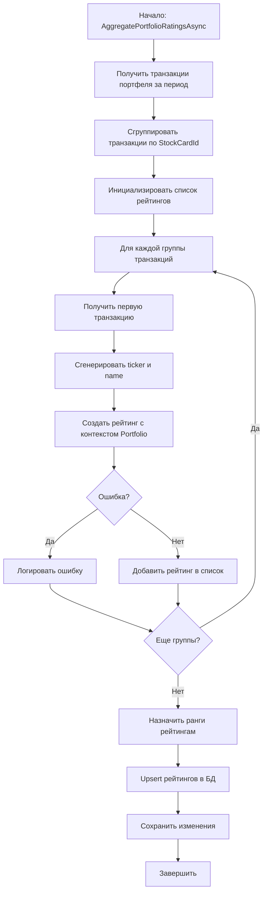
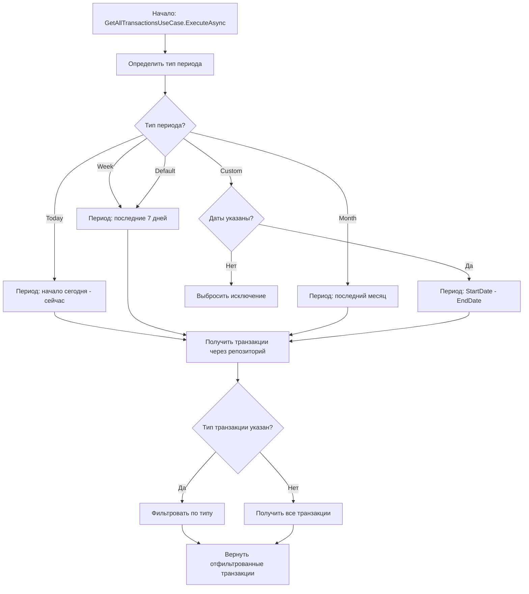
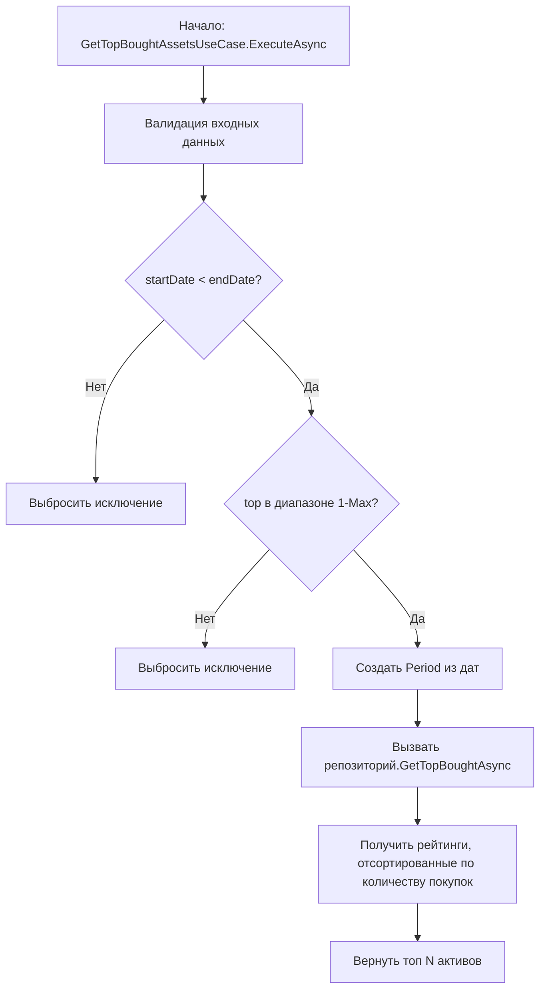
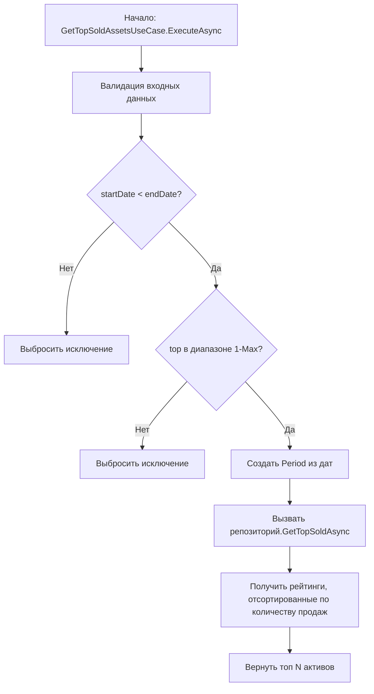
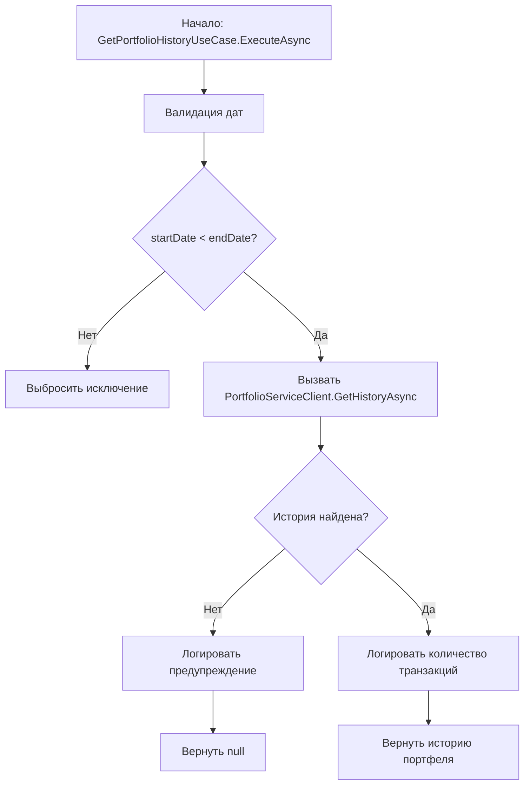
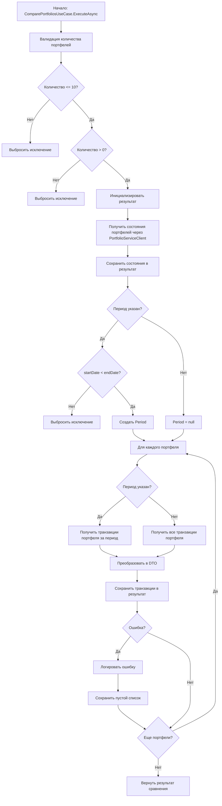
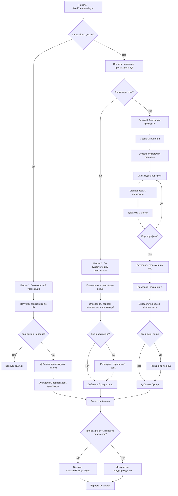
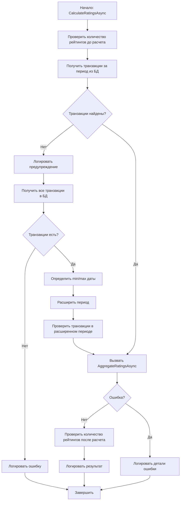

# Описание алгоритмов работы Analytics Service

Данный документ содержит описание основных алгоритмов и процедур работы сервиса аналитики с визуализацией в виде диаграмм Mermaid.

## Содержание

1. [Расчет рейтингов активов](#1-расчет-рейтингов-активов)
2. [Получение всех транзакций](#2-получение-всех-транзакций)
3. [Получение топа активов](#3-получение-топа-активов)
4. [Получение истории портфеля](#4-получение-истории-портфеля)
5. [Сравнение портфелей](#5-сравнение-портфелей)
6. [Заполнение тестовыми данными](#6-заполнение-тестовыми-данными)

---

## 1. Расчет рейтингов активов

### Описание

Алгоритм агрегирует рейтинги активов за указанный период для двух контекстов:
- **Global**: рейтинги по всем портфелям системы
- **Portfolio**: рейтинги для каждого портфеля отдельно

### Алгоритм

### Детальный алгоритм агрегации Global рейтингов

### Детальный алгоритм агрегации Portfolio рейтингов

---

## 2. Получение всех транзакций

### Описание

Алгоритм получает все транзакции за указанный период с возможностью фильтрации по типу транзакции (покупка/продажа).

### Алгоритм

---

## 3. Получение топа активов

### Описание

Алгоритм получает топ активов по количеству покупок или продаж за указанный период. Поддерживает два контекста: Global (по всем портфелям) и Portfolio (по конкретному портфелю).

### Алгоритм получения топа активов по покупкам

### Алгоритм получения топа активов по продажам

---

## 4. Получение истории портфеля

### Описание

Алгоритм получает историю транзакций конкретного портфеля за указанный период через PortfolioService.

### Алгоритм

---

## 5. Сравнение портфелей

### Описание

Алгоритм сравнивает несколько портфелей (максимум 10) за указанный период, получая их состояния и транзакции.

### Алгоритм

---

## 6. Заполнение тестовыми данными

### Описание

Алгоритм заполняет базу данных тестовыми данными. Поддерживает три режима работы:
1. По конкретной транзакции (если указан transactionId)
2. По существующим транзакциям (если транзакции есть в БД)
3. Генерация фейковых данных (если транзакций нет)

После добавления транзакций автоматически запускается расчет рейтингов.

### Алгоритм

### Алгоритм расчета рейтингов (CalculateRatingsAsync)

---

## Заключение

Все описанные алгоритмы реализуют основные функции сервиса аналитики:
- Агрегация и расчет рейтингов активов
- Получение и фильтрация транзакций
- Аналитика по активам и портфелям
- Управление тестовыми данными

Каждый алгоритм включает обработку ошибок, логирование и валидацию входных данных для обеспечения надежности работы сервиса.

